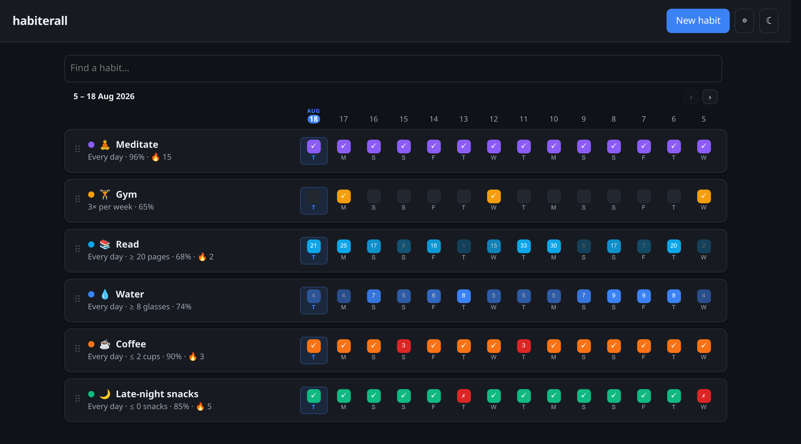
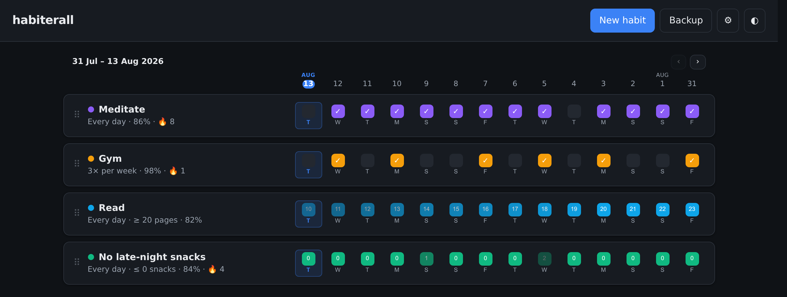
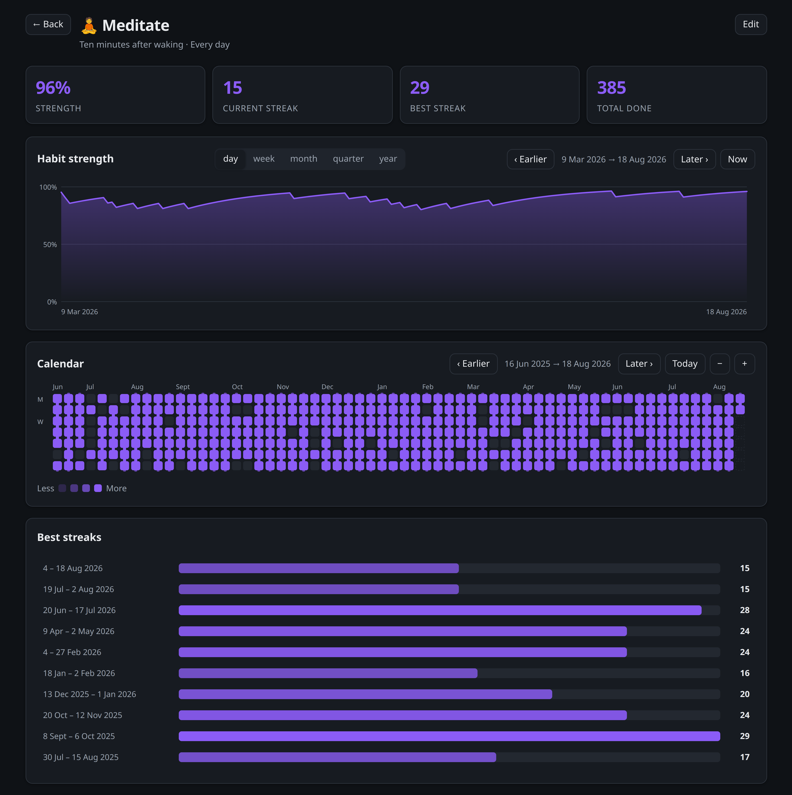
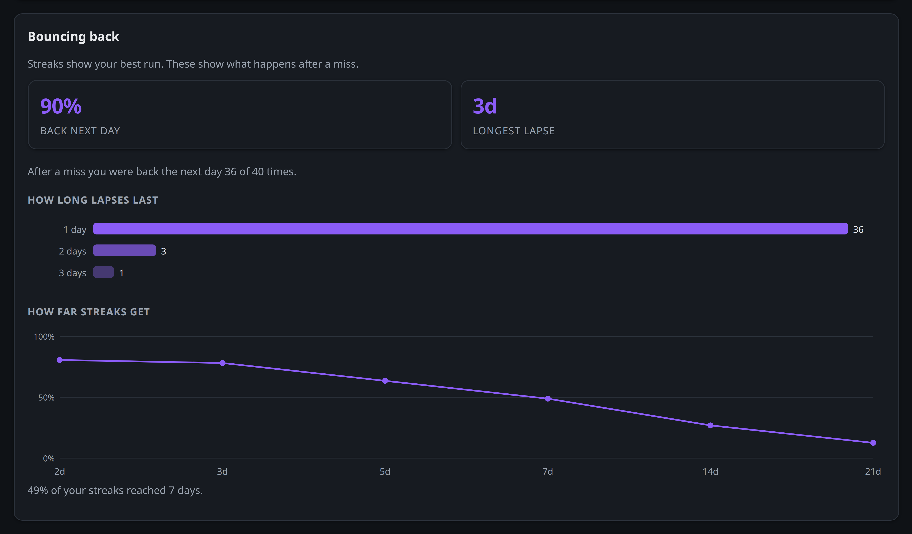
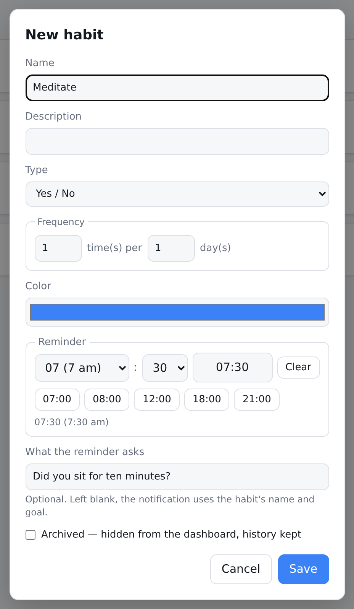
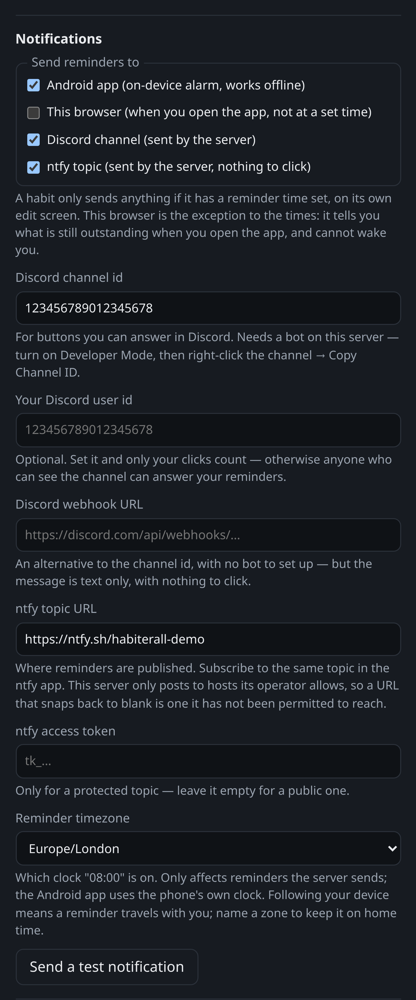
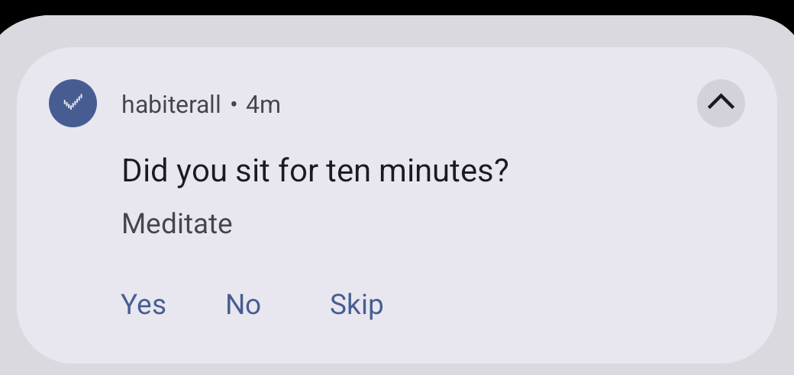
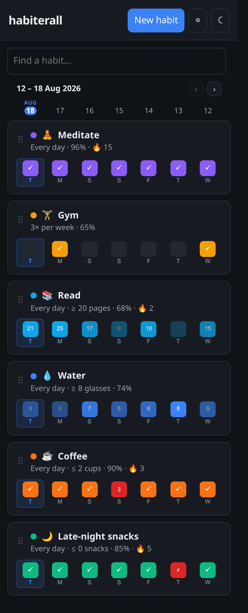
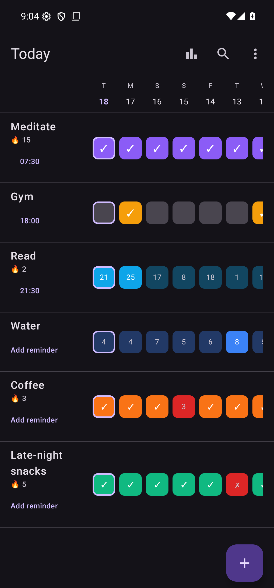

<div align="center">

# habiterall

**A self-hosted habit tracker with the statistics of [Loop Habit Tracker](https://github.com/iSoron/uhabits) — in your browser, on your server, with your data.**

[](../../actions/workflows/ci.yml)
[](LICENSE)


</div>

---

Track daily habits, see your streaks and strength over time, and keep every
byte on hardware you control. Imports directly from Loop Habit Tracker, so you
can bring your history with you — and exports back, so you are never stuck
here either.

Installs to a phone home screen as an app, works offline, and syncs when you
reconnect.

<div align="center">

<br><sub>Every screenshot in this README is the real app, with sample data.</sub>
</div>

## Contents

- [Which edition do I want?](#which-edition-do-i-want)
- [Quick start](#quick-start) · [personal](#personal-edition) · [cloud](#cloud-edition)
- [Features](#features) · [Statistics](#statistics) · [Bouncing back](#bouncing-back)
- [Reminders and notifications](#reminders-and-notifications)
- [Install on a phone](#install-on-a-phone)
- [Coming from Loop Habit Tracker](#coming-from-loop-habit-tracker)
- [Backup and restore](#backup-and-restore)
- [Configuration](#configuration) · [API](#api)
- [Security](#security-cloud-edition) · [Architecture](#architecture) · [Development](#development)

---

## Which edition do I want?

|  | **personal** | **cloud** |
|---|---|---|
| Users | one | many, each isolated |
| Login | none | any OIDC provider |
| Database | one SQLite file | Postgres |
| Setup | one command | Docker Compose + an identity provider |
| Runs on | `http://localhost:3000` | `http://localhost:3100` |
| Best for | your own machine, or a home LAN | a server other people log in to |

**Start with personal.** It has no moving parts, and a JSON backup imports
straight into cloud later if you outgrow it.

---

## Quick start

Both editions ship as published images on GHCR, so there is nothing to clone,
nothing to build, and no source code on your server. Each section below ends
with a note for running from a checkout instead, which is what you want for
development.

### personal edition

The published image needs no clone and no build. Save this as
`docker-compose.yml` anywhere:

<!-- generated from examples/docker-compose.personal.yml — edit that file, then `npm run docs:compose` -->
```yaml
services:
  habiterall:
    image: ghcr.io/easymod0/habiterall-personal:latest
    container_name: habiterall
    ports:
      - '${APP_PORT:-3000}:3000'
    volumes:
      - habiterall-data:/data        # your whole database is one file in here
    environment:
      HABITERALL_DB: /data/habiterall.db
      TZ: ${TZ:-Etc/UTC}             # SET THIS — a container is UTC otherwise

      # Set both before exposing this port, or the first visitor claims the app.
      HABITERALL_USERNAME: ${HABITERALL_USERNAME:-}              # default "admin"
      HABITERALL_PASSWORD: ${HABITERALL_PASSWORD:-}              # 8+ characters
      HABITERALL_PASSWORD_HASH: ${HABITERALL_PASSWORD_HASH:-}    # or this instead
      HABITERALL_AUTH: ${HABITERALL_AUTH:-}                      # exactly "off" disables sign-in
      HABITERALL_SESSION_SECRET: ${HABITERALL_SESSION_SECRET:-}  # survives a redeploy

      TRUST_PROXY: ${TRUST_PROXY:-0}                             # 1 behind a reverse proxy
      HABITERALL_UPGRADE_INSECURE: ${HABITERALL_UPGRADE_INSECURE:-}  # "on" if https-only
      HABITERALL_RATE_LIMIT: ${HABITERALL_RATE_LIMIT:-}          # "off" on a trusted LAN

      HABITERALL_NOTIFY: ${HABITERALL_NOTIFY:-on}                # reminders this server sends
      HABITERALL_NOTIFY_INTERVAL_MS: ${HABITERALL_NOTIFY_INTERVAL_MS:-60000}
      HABITERALL_PUBLIC_URL: ${HABITERALL_PUBLIC_URL:-}          # https://habits.example.com
      DISCORD_BOT_TOKEN: ${DISCORD_BOT_TOKEN:-}                  # adds Yes / No / Skip buttons
    restart: unless-stopped

volumes:
  habiterall-data:
```
<!-- /generated -->

```bash
docker compose up -d
```

Open **<http://localhost:3000>**.

If you set `HABITERALL_USERNAME` and `HABITERALL_PASSWORD` above, sign in with
them and that is the whole setup. If you left them blank you are asked to
**create an account** on that first visit — and until somebody does, *anyone who
can reach the port* can be that somebody. On a laptop or a home LAN that is
exactly what you want and takes ten seconds. Anywhere reachable from the
internet, fill the two variables in first, so there is no window to walk
through.

Sign-in can be turned off entirely with `HABITERALL_AUTH=off`, which restores
what this edition did before it had any: every route open to whoever can reach
it. That is a real option for a machine only you can talk to — see
[Turning the guards off](#turning-the-guards-off) for that setting and the
others alongside it.

That file is also in the repository as
[`examples/docker-compose.personal.yml`](examples/docker-compose.personal.yml)
(and the two cloud ones beside it). What is printed above is *generated* from
it, and it is the same file the repository's own
`habiterall-personal/docker-compose.yml` extends — so the variables listed
there are all of them, and a test fails if the server grows one that is
missing. To update:

```bash
docker compose pull && docker compose up -d
```

<details>
<summary><b>Or from a clone, with no Docker at all</b></summary>

Requires **Node 26+**, the major both Docker images ship. There is no build
step — what runs is what is on disk.

```bash
git clone <your-repo-url> habiterall
cd habiterall
npm install
npm run start:personal
```

Also **<http://localhost:3000>**, with the database at
`habiterall-personal/data/habiterall.db`. Optionally seed sample data first with
`npm run seed -w habiterall-personal`.
</details>

### cloud edition

Multi user, so it needs a database and somewhere to sign in. This brings both:
the published image, Postgres, and Authentik as the identity provider — nothing
to build, and no source on the server. Save as `docker-compose.yml`:

<!-- generated from examples/docker-compose.cloud-authentik.yml — edit that file, then `npm run docs:compose` -->
```yaml
services:
  db:
    image: postgres:17-alpine
    environment:
      POSTGRES_DB: habiterall
      POSTGRES_USER: habiterall_owner
      POSTGRES_PASSWORD: ${DB_OWNER_PASSWORD:?set it in .env}
    volumes:
      - db-data:/var/lib/postgresql/data
    healthcheck:
      test: ['CMD-SHELL', 'pg_isready -U habiterall_owner -d habiterall']
      interval: 5s
      retries: 20
    restart: unless-stopped

  authentik-db:
    image: postgres:17-alpine
    environment:
      POSTGRES_DB: authentik
      POSTGRES_USER: authentik
      POSTGRES_PASSWORD: ${AUTHENTIK_DB_PASSWORD:?set it in .env}
    volumes:
      - authentik-db-data:/var/lib/postgresql/data
    healthcheck:
      test: ['CMD-SHELL', 'pg_isready -U authentik -d authentik']
      interval: 5s
      retries: 20
    restart: unless-stopped

  authentik-server:
    image: ghcr.io/goauthentik/server:2026.5.6
    command: server
    depends_on:
      authentik-db: { condition: service_healthy }
    environment:
      AUTHENTIK_SECRET_KEY: ${AUTHENTIK_SECRET_KEY:?openssl rand -base64 60}
      AUTHENTIK_POSTGRESQL__HOST: authentik-db
      AUTHENTIK_POSTGRESQL__NAME: authentik
      AUTHENTIK_POSTGRESQL__USER: authentik
      AUTHENTIK_POSTGRESQL__PASSWORD: ${AUTHENTIK_DB_PASSWORD}
      # Only needed to create the first admin; harmless to leave set.
      AUTHENTIK_BOOTSTRAP_PASSWORD: ${AUTHENTIK_BOOTSTRAP_PASSWORD:-}
      AUTHENTIK_BOOTSTRAP_EMAIL: ${AUTHENTIK_BOOTSTRAP_EMAIL:-admin@example.com}
      AUTHENTIK_BOOTSTRAP_TOKEN: ${AUTHENTIK_BOOTSTRAP_TOKEN:-}
      # Only self-service registration with email verification sends mail.
      AUTHENTIK_EMAIL__HOST: ${AUTHENTIK_EMAIL__HOST:-localhost}
      AUTHENTIK_EMAIL__PORT: ${AUTHENTIK_EMAIL__PORT:-587}
      AUTHENTIK_EMAIL__USERNAME: ${AUTHENTIK_EMAIL__USERNAME:-}
      AUTHENTIK_EMAIL__PASSWORD: ${AUTHENTIK_EMAIL__PASSWORD:-}
      AUTHENTIK_EMAIL__USE_TLS: ${AUTHENTIK_EMAIL__USE_TLS:-true}
      AUTHENTIK_EMAIL__USE_SSL: ${AUTHENTIK_EMAIL__USE_SSL:-false}
      AUTHENTIK_EMAIL__FROM: ${AUTHENTIK_EMAIL__FROM:-habiterall@example.com}
    # Filled by authentik-bootstrap out of the habiterall image. The two asset
    # volumes land under directories Authentik already serves at
    # /static/dist/assets/, which is one of the two forms its brand settings
    # accept without an upload.
    volumes:
      - authentik-blueprints:/blueprints/custom
      - authentik-icons:/web/dist/assets/icons/habiterall
      - authentik-images:/web/dist/assets/images/habiterall
    ports:
      - '${AUTHENTIK_PORT:-9000}:9000'
    restart: unless-stopped

  authentik-worker:
    image: ghcr.io/goauthentik/server:2026.5.6
    command: worker
    depends_on:
      authentik-db: { condition: service_healthy }
    environment:
      AUTHENTIK_SECRET_KEY: ${AUTHENTIK_SECRET_KEY}
      AUTHENTIK_POSTGRESQL__HOST: authentik-db
      AUTHENTIK_POSTGRESQL__NAME: authentik
      AUTHENTIK_POSTGRESQL__USER: authentik
      AUTHENTIK_POSTGRESQL__PASSWORD: ${AUTHENTIK_DB_PASSWORD}
      AUTHENTIK_BOOTSTRAP_PASSWORD: ${AUTHENTIK_BOOTSTRAP_PASSWORD:-}
      AUTHENTIK_BOOTSTRAP_EMAIL: ${AUTHENTIK_BOOTSTRAP_EMAIL:-admin@example.com}
      AUTHENTIK_BOOTSTRAP_TOKEN: ${AUTHENTIK_BOOTSTRAP_TOKEN:-}
      AUTHENTIK_EMAIL__HOST: ${AUTHENTIK_EMAIL__HOST:-localhost}
      AUTHENTIK_EMAIL__PORT: ${AUTHENTIK_EMAIL__PORT:-587}
      AUTHENTIK_EMAIL__USERNAME: ${AUTHENTIK_EMAIL__USERNAME:-}
      AUTHENTIK_EMAIL__PASSWORD: ${AUTHENTIK_EMAIL__PASSWORD:-}
      AUTHENTIK_EMAIL__USE_TLS: ${AUTHENTIK_EMAIL__USE_TLS:-true}
      AUTHENTIK_EMAIL__USE_SSL: ${AUTHENTIK_EMAIL__USE_SSL:-false}
      AUTHENTIK_EMAIL__FROM: ${AUTHENTIK_EMAIL__FROM:-habiterall@example.com}
    # The worker is what lists the blueprint directory for the endpoint that
    # applies one, and what sends the mail. It needs the same files.
    volumes:
      - authentik-blueprints:/blueprints/custom
      - authentik-icons:/web/dist/assets/icons/habiterall
      - authentik-images:/web/dist/assets/images/habiterall
    restart: unless-stopped

  # Configures Authentik from this file's .env: the OIDC provider and
  # application, self-service registration, and the branding on the sign-in
  # pages. Runs to completion on every `up`, and is idempotent — everything is
  # looked up before it is written, so re-running it is how a changed .env
  # takes effect.
  #
  # It also copies the blueprints and the two images out of the habiterall
  # image into the volumes above, which is the step that makes this file work
  # without a checkout of the repository. That copy OVERWRITES, so pulling a
  # newer image is what updates them.
  #
  # Without AUTHENTIK_BOOTSTRAP_TOKEN it does nothing and exits 0 — supported,
  # and the reason `up` keeps working once you have removed the token. It says
  # so, and names the switches that have no effect while it is gone.
  authentik-bootstrap:
    image: ghcr.io/easymod0/habiterall-cloud:latest
    depends_on:
      authentik-server: { condition: service_started }
      authentik-worker: { condition: service_started }
    environment:
      AUTHENTIK_URL: http://authentik-server:9000
      # The API is reached over this network; the ISSUER has to be the string a
      # browser sees, and they are not the same host.
      AUTHENTIK_PUBLIC_URL: ${AUTHENTIK_PUBLIC_URL:-http://localhost:${AUTHENTIK_PORT:-9000}}
      AUTHENTIK_BOOTSTRAP_TOKEN: ${AUTHENTIK_BOOTSTRAP_TOKEN:-}
      PUBLIC_URL: ${PUBLIC_URL:?the address browsers use, https in production}
      OIDC_ISSUER: ${OIDC_ISSUER:-}
      OIDC_CLIENT_ID: ${OIDC_CLIENT_ID:?openssl rand -hex 32}
      OIDC_CLIENT_SECRET: ${OIDC_CLIENT_SECRET:?openssl rand -hex 32}
      AUTHENTIK_SELF_SIGNUP: ${AUTHENTIK_SELF_SIGNUP:-off}
      AUTHENTIK_SELF_SIGNUP_VERIFY_EMAIL: ${AUTHENTIK_SELF_SIGNUP_VERIFY_EMAIL:-off}
      AUTHENTIK_BRANDING: ${AUTHENTIK_BRANDING:-on}
      AUTHENTIK_EMAIL__HOST: ${AUTHENTIK_EMAIL__HOST:-}
      # Set only here: this is the container with the files to copy.
      AUTHENTIK_BLUEPRINTS_OUT: /out/blueprints
      AUTHENTIK_ICONS_OUT: /out/icons
      AUTHENTIK_IMAGES_OUT: /out/images
    volumes:
      - authentik-blueprints:/out/blueprints
      - authentik-icons:/out/icons
      - authentik-images:/out/images
    command: ['node', 'scripts/bootstrap-authentik.mjs']
    restart: 'no'

  # Runs once per deploy, as a SEPARATE credential the app never holds — it is
  # the only thing allowed to change the schema. `up -d` waits for it to finish.
  migrate:
    image: ghcr.io/easymod0/habiterall-cloud:latest
    depends_on:
      db: { condition: service_healthy }
    environment:
      DATABASE_URL_ADMIN: postgres://habiterall_owner:${DB_OWNER_PASSWORD}@db:5432/habiterall
      APP_DB_PASSWORD: ${APP_DB_PASSWORD:?set it in .env}
    command: ['node', 'src/db/migrate.js']
    restart: 'no'

  app:
    image: ghcr.io/easymod0/habiterall-cloud:latest
    depends_on:
      db: { condition: service_healthy }
      migrate: { condition: service_completed_successfully }
      authentik-bootstrap: { condition: service_completed_successfully }
    ports:
      - '${APP_PORT:-3100}:3000'
    environment:
      NODE_ENV: production
      # The RESTRICTED role — not the owner. This is what makes a forgotten
      # WHERE clause return nothing instead of another user's rows.
      DATABASE_URL: postgres://habiterall_app:${APP_DB_PASSWORD}@db:5432/habiterall
      SESSION_SECRET: ${SESSION_SECRET:?openssl rand -base64 36}
      PUBLIC_URL: ${PUBLIC_URL:?the address browsers use, https in production}
      OIDC_ISSUER: ${OIDC_ISSUER:?from Authentik, ends in a slash}
      # `:?` now, where this file once had `:-`. There used to be a phase where
      # these were legitimately empty — the first of a two-phase start, whose
      # purpose was to create the client they would hold — and compose
      # interpolates the WHOLE file before it works out which services you
      # asked for, so requiring them here would have failed that phase too.
      # The bootstrap ends the two-phase start: these are values you generate,
      # not values you collect, so there is no moment when empty is correct.
      OIDC_CLIENT_ID: ${OIDC_CLIENT_ID:?openssl rand -hex 32}
      OIDC_CLIENT_SECRET: ${OIDC_CLIENT_SECRET:?openssl rand -hex 32}
      ALLOW_INSECURE_OIDC: ${ALLOW_INSECURE_OIDC:-false}   # local testing ONLY
      TRUST_PROXY: ${TRUST_PROXY:-1}                       # TLS terminators in front
      DISCORD_BOT_TOKEN: ${DISCORD_BOT_TOKEN:-}            # adds Yes / No / Skip buttons
      HABITERALL_NOTIFY: ${HABITERALL_NOTIFY:-on}          # reminders this server sends
      HABITERALL_NOTIFY_INTERVAL_MS: ${HABITERALL_NOTIFY_INTERVAL_MS:-60000}
      NOTIFY_MAX_ACCOUNTS: ${NOTIFY_MAX_ACCOUNTS:-500}     # accounts visited per tick
      # The fallback clock: a container has no timezone, so it is UTC. Users can
      # override it for their own reminders in ⚙ → Notifications, but this is
      # what "the server's own timezone" means, and it is also the clock that
      # decides which day a check-off with no explicit date belongs to.
      TZ: ${TZ:-Etc/UTC}
    restart: unless-stopped

volumes:
  db-data:
  authentik-db-data:
  # Refilled from the habiterall image by authentik-bootstrap on every `up`,
  # and read by Authentik. They mirror the image rather than holding config of
  # your own: a file edited in here is overwritten on the next start, which is
  # what makes an upgraded image's blueprints and branding take effect. Change
  # them in an image you build.
  authentik-blueprints:
  authentik-icons:
  authentik-images:
```
<!-- /generated -->

**Two hostnames, not one.** `PUBLIC_URL` is where habiterall answers and
`OIDC_ISSUER` is where Authentik does, and they must be different origins
unless your proxy path-routes `/application/*`, `/if/*` and
`/outpost.goauthentik.io/*` to Authentik. Point `auth.example.com` at the
Authentik container's published port and `habits.example.com` at the app's.
Putting the issuer on the app's own hostname produces a memorable failure: the
proxy asks habiterall for Authentik's discovery document, the app is still
starting — because it is waiting on that very document — and you get a 502
that looks like a proxy fault rather than a configuration one.

Alongside it, a `.env`:

```bash
# hex, not base64: these two go into a connection URL, and base64's '/' ends
# the URL's authority — about half of generated passwords contain one.
DB_OWNER_PASSWORD=$(openssl rand -hex 32)
APP_DB_PASSWORD=$(openssl rand -hex 32)
AUTHENTIK_DB_PASSWORD=$(openssl rand -base64 36)
AUTHENTIK_SECRET_KEY=$(openssl rand -base64 60)
AUTHENTIK_BOOTSTRAP_PASSWORD=       # the first admin's password
AUTHENTIK_BOOTSTRAP_TOKEN=$(openssl rand -base64 36)
SESSION_SECRET=$(openssl rand -base64 36)
PUBLIC_URL=https://habits.example.com
OIDC_ISSUER=https://auth.example.com/application/o/habiterall/
AUTHENTIK_PUBLIC_URL=https://auth.example.com
# Yours to choose, not Authentik's to hand you: the stack configures the
# provider WITH these, so nothing is pasted back.
OIDC_CLIENT_ID=$(openssl rand -hex 32)
OIDC_CLIENT_SECRET=$(openssl rand -hex 32)
APP_PORT=3100                       # optional — the host port the app answers on
AUTHENTIK_PORT=9000                 # optional — the host port Authentik answers on
```

Then start it, once:

```bash
docker compose up -d
```

There is no second phase and nothing to click. The `authentik-bootstrap`
service runs the same image as the app and creates the OIDC provider and
application over Authentik's API, *giving* it the id and secret from `.env` —
which is why those are values you generate rather than values you collect. It
also copies the blueprints and images it needs out of that image, so this
works on a server with no checkout of this repository. It runs to completion
on every `up`, and re-running it is how a changed `.env` takes effect:

```bash
docker compose logs authentik-bootstrap
#   created provider
#   created application
#   branding: habiterall
#   self-service registration: OFF
```

| | |
|---|---|
| **The app** | **<http://localhost:3100>** |
| Authentik admin | <http://localhost:9000> (sign in as `akadmin`) |

Create users in Authentik under *Directory → Users*; a habiterall account is
provisioned the first time each one signs in.

**Or let people create their own.** `AUTHENTIK_SELF_SIGNUP=on` in `.env`, then
`docker compose up -d`, and the login page grows a **Sign up** link — anyone
who can reach that page can then create an account, which on a public instance
is everyone. `AUTHENTIK_SELF_SIGNUP_VERIFY_EMAIL=on` makes them confirm the
address first, and needs a real SMTP server in the `AUTHENTIK_EMAIL__*`
settings. `off` removes the link *and* the sign-up page behind it. The sign-in
pages carry habiterall's name and colours unless you set
`AUTHENTIK_BRANDING=off`. Read
[`habiterall-cloud/SETUP.md`](habiterall-cloud/SETUP.md) before opening
registration on an Authentik that serves anything else — the link goes on the
instance-wide login flow, so what a stranger creates is an Authentik account.

<details>
<summary><b>Or from a clone, which is the same stack built from source</b></summary>

The compose file in the repository builds the image instead of pulling it, and
puts Authentik's database in the same Postgres server as habiterall's rather
than running a second one. Everything else is the same file: the bootstrap
configures Authentik identically, except that it reads the blueprints and
images straight from the checkout, so editing one takes effect on the next
request instead of on the next build.

```bash
git clone <your-repo-url> habiterall
cd habiterall/habiterall-cloud
cp .env.example .env          # then fill in the secrets it lists
docker compose up -d
```

`habiterall-cloud/SETUP.md` is the longer version, including TLS, backups and
what to check before a real deployment.
</details>

**Already run an identity provider?** The stack above brings its own Authentik,
which is the quickest way to have *one*. If you already have Keycloak, Authelia,
Entra or Auth0, use
[`examples/docker-compose.cloud.yml`](examples/docker-compose.cloud.yml) instead
— the published image, Postgres, and nothing else.

<details>
<summary><b>Show that file</b></summary>

<!-- generated from examples/docker-compose.cloud.yml — edit that file, then `npm run docs:compose` -->
```yaml
services:
  db:
    image: postgres:17-alpine
    environment:
      POSTGRES_DB: habiterall
      POSTGRES_USER: habiterall_owner
      POSTGRES_PASSWORD: ${DB_OWNER_PASSWORD:?set it in .env}
    volumes:
      - db-data:/var/lib/postgresql/data
    healthcheck:
      test: ['CMD-SHELL', 'pg_isready -U habiterall_owner -d habiterall']
      interval: 5s
      retries: 20
    restart: unless-stopped

  # Runs once per deploy, as a SEPARATE credential the app never holds — it is
  # the only thing allowed to change the schema. `up -d` waits for it to finish.
  migrate:
    image: ghcr.io/easymod0/habiterall-cloud:latest
    depends_on:
      db: { condition: service_healthy }
    environment:
      DATABASE_URL_ADMIN: postgres://habiterall_owner:${DB_OWNER_PASSWORD}@db:5432/habiterall
      APP_DB_PASSWORD: ${APP_DB_PASSWORD:?set it in .env}
    command: ['node', 'src/db/migrate.js']
    restart: 'no'

  app:
    image: ghcr.io/easymod0/habiterall-cloud:latest
    depends_on:
      db: { condition: service_healthy }
      migrate: { condition: service_completed_successfully }
    ports:
      - '${APP_PORT:-3100}:3000'
    environment:
      NODE_ENV: production
      # The RESTRICTED role — not the owner. This is what makes a forgotten
      # WHERE clause return nothing instead of another user's rows.
      DATABASE_URL: postgres://habiterall_app:${APP_DB_PASSWORD}@db:5432/habiterall
      SESSION_SECRET: ${SESSION_SECRET:?openssl rand -base64 36}
      PUBLIC_URL: ${PUBLIC_URL:?the address browsers use, https in production}
      OIDC_ISSUER: ${OIDC_ISSUER:?from your provider}
      OIDC_CLIENT_ID: ${OIDC_CLIENT_ID:?}
      OIDC_CLIENT_SECRET: ${OIDC_CLIENT_SECRET:?}
      ALLOW_INSECURE_OIDC: ${ALLOW_INSECURE_OIDC:-false}   # local testing ONLY
      TRUST_PROXY: ${TRUST_PROXY:-1}                       # TLS terminators in front
      DISCORD_BOT_TOKEN: ${DISCORD_BOT_TOKEN:-}            # adds Yes / No / Skip buttons
      HABITERALL_NOTIFY: ${HABITERALL_NOTIFY:-on}          # reminders this server sends
      HABITERALL_NOTIFY_INTERVAL_MS: ${HABITERALL_NOTIFY_INTERVAL_MS:-60000}
      NOTIFY_MAX_ACCOUNTS: ${NOTIFY_MAX_ACCOUNTS:-500}     # accounts visited per tick
      # The fallback clock: a container has no timezone, so it is UTC. Users can
      # override it for their own reminders in ⚙ → Notifications, but this is
      # what "the server's own timezone" means, and it is also the clock that
      # decides which day a check-off with no explicit date belongs to.
      TZ: ${TZ:-Etc/UTC}
    restart: unless-stopped

volumes:
  db-data:
```
<!-- /generated -->

Register `${PUBLIC_URL}/auth/callback` as the redirect URI with your provider.
Users are provisioned the first time each one signs in.

> **Pin the tag here.** `latest` is fine for the personal edition, where an
> update is a new binary against the same file. The cloud edition runs
> migrations on deploy, so pulling `latest` means taking a schema change at a
> moment you did not choose. Use `:0.0.1` and bump it deliberately.
</details>

Full walkthrough, including HTTPS and the production checklist:
**[habiterall-cloud/SETUP.md](habiterall-cloud/SETUP.md)**.

### Put HTTPS in front

Not optional, and not only for the usual reasons — two features here are
load-bearing on it:

- **Offline and installability.** Service workers are disabled on plaintext
  origins other than `localhost`, so without HTTPS there is no offline mode, no
  outbox, and no *Add to Home Screen*.
- **Signing in (cloud).** The session cookie is marked `Secure` whenever
  `PUBLIC_URL` is https, and a browser discards a `Secure` cookie sent over
  plain HTTP. Login then fails with no error message at all — it simply loops
  back to the sign-in page.

[`examples/Caddyfile`](examples/Caddyfile) is the whole thing, certificate
included:

<!-- generated from examples/Caddyfile — edit that file, then `npm run docs:compose` -->
```caddyfile
habits.example.com {
	# Caddy gets and renews the certificate itself. Nothing else to configure.
	reverse_proxy localhost:3000
}
```
<!-- /generated -->

```bash
docker compose up -d      # habiterall on :3000
caddy run                 # or: sudo caddy start
```

<details>
<summary><b>nginx, if you already run it</b></summary>

```nginx
server {
    listen 443 ssl;
    server_name habits.example.com;

    ssl_certificate     /etc/letsencrypt/live/habits.example.com/fullchain.pem;
    ssl_certificate_key /etc/letsencrypt/live/habits.example.com/privkey.pem;

    location / {
        proxy_pass http://127.0.0.1:3000;
        proxy_set_header Host              $host;
        proxy_set_header X-Real-IP         $remote_addr;
        # The cloud edition's rate limiter keys on the client address, so
        # without this every request appears to come from the proxy and one
        # user's traffic throttles everybody.
        proxy_set_header X-Forwarded-For   $proxy_add_x_forwarded_for;
        # And this is what tells the app the browser is on https, which is what
        # makes the session cookie Secure.
        proxy_set_header X-Forwarded-Proto $scheme;
    }
}
```
</details>

<details>
<summary><b>Nginx Proxy Manager</b></summary>

Nothing to write — it is all in the web UI, and its default proxy config
already sends the headers above. **Hosts → Proxy Hosts → Add Proxy Host:**

| Field | Value |
|---|---|
| Domain Names | `habits.example.com` |
| Scheme | `http` — this is the hop *behind* the proxy, not what your browser uses |
| Forward Hostname / IP | the container name (`habiterall`) if it shares a Docker network with NPM, otherwise the host's LAN IP |
| Forward Port | `3000` (personal) or `3100` (cloud) |
| Cache Assets | off — the app's service worker already does this, and a stale `index.html` served from the proxy pins clients to an old build |
| Block Common Exploits | on |
| Websockets Support | not needed; harmless if on |
| **SSL** tab | request a Let's Encrypt certificate, then **Force SSL** on |

The one that catches everybody: **`localhost` in *Forward Hostname* means NPM's
own container**, not your server. It resolves, connects to nothing, and shows a
502 — which reads like the app is down. Put both on one network instead:

```yaml
services:
  habiterall:
    image: ghcr.io/easymod0/habiterall-personal:latest
    expose: ['3000']        # not `ports:` — only NPM needs to reach it
    volumes: ['habiterall-data:/data']
    environment:
      HABITERALL_DB: /data/habiterall.db
    networks: [proxy]
    restart: unless-stopped

networks:
  proxy:
    external: true          # the network Nginx Proxy Manager is already on
volumes:
  habiterall-data:
```

Then *Forward Hostname* is `habiterall` and *Forward Port* is `3000`.
</details>

Whichever you use: with one proxy in front, set **`TRUST_PROXY=1`**. Use the
number of proxies if there are more, and `0` when the app is reached directly.
The two editions default differently on purpose — cloud to `1`, because its
documented deployment has TLS in front, and personal to `0`, because its
quickstart is a port on a LAN with nothing in front at all.

Getting it wrong is a bug in both directions. Too low and every caller looks
like the proxy, so one client spends everyone's rate limit, the session cookie
cannot be marked `Secure`, and a proxy that rewrites `Host` makes every write
look cross-origin and get refused. Too high and `X-Forwarded-For` becomes the
caller's to choose, which is the rate limiter's only key — forty guesses at the
password walk through a limit of twenty by rotating one header. The server logs
`trust_proxy` at startup and warns when a forwarded header arrives that it has
been told not to believe.

One thing that follows and is easy to get wrong: **if you set `TRUST_PROXY=1`,
the app's port must only be reachable through the proxy.** Leaving 3000 open on
the LAN as a shortcut means anything on that LAN can send those headers itself.
Publish the port only to the proxy's network, or firewall it, and reach the app
by its proxied name from inside the house as well as outside.

### Turning the guards off

The personal edition is meant to be run on a laptop, a NAS or a LAN as readily
as on the internet, so most of the hardening is a setting rather than a fact.
For an instance only reachable over a VPN or a trusted network:

| Set | Effect |
|---|---|
| `HABITERALL_AUTH=off` | No sign-in at all. Every route is open to whoever can reach the port, exactly as this edition behaved before it had auth. The value must be **exactly** `off` — `false`, `0` and every typo leave it on, and the server says so at startup. |
| `HABITERALL_RATE_LIMIT=off` | Removes the limits on the API, imports and test notifications. The limit on *login attempts* is deliberately not included and cannot be switched off. |
| `TRUST_PROXY=0` (the default) | Nothing in front is believed. Right for a direct port; see above. |
| `HABITERALL_UPGRADE_INSECURE` unset (the default) | Browsers are **not** told to rewrite http to https. Leave it unset unless the instance is only ever reached over TLS — turning it on breaks a box that answers on both. |
| `NODE_ENV` unset | No HSTS header. A browser that sees one on a plain-http stack pins that hostname to https for a year, and `localhost` is a hostname a lot of other things use too. |

The session cookie needs nothing: it is marked `Secure` only on requests that
actually arrived over TLS, so a plain-http LAN instance and an https one behind
a proxy both work, including when they are the same instance.

Two things have no switch, and both are load bearing rather than decorative.
The **Content-Security-Policy** is what makes the frontend's design true —
`connect-src 'self'` is the reason the browser cannot post to a Discord webhook
and the server keeps time for reminders instead — so relaxing it changes the
architecture, not a header. And the **cross-origin check** on writes costs a
same-origin client nothing: browsers send `Origin` on every state-changing
request, a request without one is allowed through (that is how the Android
client posts), and what it refuses is a page on another site using your logged-in
browser as a lever. Neither of those gets safer on a VPN.

---

## Features

**Two habit types** — yes/no checkmarks, and measurable habits with a target
and an *at least* / *at most* goal, so both "drink 8 glasses" and "at most 0
cigarettes" work.

**Any frequency** — *n* times per *m* days. A habit held at exactly its target
reaches full strength whether that is daily or 3×/week.

**Edit any day** — click a square in the calendar to correct history, page
back through months, or attach a note explaining why a day went the way it
did.

**Skips** — a skipped day is neither success nor failure. It bridges streaks
instead of breaking them, and holds your score steady. Use it for illness or
travel.

**Archive** — retire a habit without deleting its history.

**Reorder** — drag by the handle, or focus it and use ↑ / ↓.

**Undo** — deleting a habit offers an Undo that restores it with every entry
and note intact.

**Reminders, where you want them** — set a time on a habit, choose what the
reminder *asks* ("Did you exercise today?"), and pick where it goes under ⚙ →
Notifications: the Android app, a Discord channel, or both. In Discord you can
answer with a button without leaving the chat. See
[Reminders and notifications](#reminders-and-notifications).

**Works offline** — check off habits with no signal; they queue on the device
and sync, in order, when you reconnect. Reconnection is automatic, and does not
rely on the browser noticing: the app re-checks when you come back to the tab
and keeps probing while it is down, so restarting the server does not leave a
page stranded.

**Light and dark**, following your system preference — and a toggle for when it
disagrees with you.

<div align="center">

</div>

### Statistics

| View | What it shows |
|---|---|
| **Strength** | Loop's exponential-decay score, plotted by day / week / month / quarter / year |
| **Calendar** | A clickable heatmap with streaks joined up, zoomable and pageable |
| **History** | Completions by day / week / month / quarter / year, as a percentage or a count |
| **Best streaks** | Your ten longest runs, listed newest first with the dates |
| **Bouncing back** | What happens *after* a miss — see below |
| **By day of week** | Which days you reliably miss |
| **Weekday consistency** | The same, month by month, so you can see a weekday slipping |
| **Times per week** | How many weeks each month hit 1×, 2×, 3× … |

Every chart with a time axis pages through history rather than cramming years
into one screen, and the number of columns follows the width you have.

Plus current streak, best streak, and total completions at a glance.

<div align="center">

</div>

### Bouncing back

Streaks reward perfection and punish one bad day. **Bouncing back** measures
the thing that actually decides whether a habit survives — what happens after
you miss:

- **Recovery rate** — of every lapse that ended, how often were you back the
  very next day?
- **How long lapses last** — misses clustered at one day mean a habit that
  self-corrects; a fat tail means one that, once dropped, stays dropped.
- **How far streaks get** — of all the streaks you started, what share reached
  3 days? 7? 30? The cliff in that curve locates where this habit reliably
  breaks, which "best streak: 23" cannot tell you.

Two habits can both recover 100% of the time and still be nothing alike: one
clears a week 86% of the time, the other 40%. Only the survival curve
separates them.

<div align="center">

</div>

> Shown for daily habits only. For a 3×/week habit an off-day is not a
> failure, so these figures would be measuring the wrong thing.

---

## Reminders and notifications

A reminder has two halves, set in two places:

1. **When** — a time on the habit itself, on its edit screen. Pick it from the
   hour and minute dropdowns, or type it: `8:30`, `8:30 pm`, `830` and `8` all
   work, and become `08:30`. No time, no reminder. It is a wall-clock time —
   08:00 means eight in the morning, and stays there across a DST change.
2. **Where** — under ⚙ → **Notifications**, as a list of destinations. They are
   not exclusive; pick as many as you like.

<div align="center">

&nbsp;&nbsp;

<br><sub><b>When</b>, on the habit · <b>Where</b>, in settings</sub>
</div>

| Destination | Delivered by | Answer from it | Works offline | Needs |
|---|---|---|---|---|
| **Android app** | the phone, as a local alarm | Yes / No / a count, from the shade — or tap the notification itself to open the app on that habit | yes | the [native app](android-native/README.md) |
| **Discord (bot)** | your server | Yes / No / Skip buttons, and a box for an amount | no | a Discord application |
| **Discord (webhook)** | your server | nothing — text only | no | a webhook URL |

Nothing is sent for a habit you have already recorded that day.

### What the reminder asks

Each habit has an optional **What the reminder asks** field. Left blank you get
the habit's name and a generated line; filled in, it leads:

> **Did you exercise today?**
> Meditate · Goal: at least 8 glasses.

For a measurable habit this is where it pays off — "How many cups of water did
you drink today?" is a question, where "Meditate / time to log this one" is a
form. The same text is used by the Android notification and the Discord message,
and it labels the amount box you type into.

<div align="center">

<br><sub>The same question, in the Android shade — answered without opening anything.</sub>
</div>

### Discord with buttons (recommended)

Buttons need a Discord **application**, because Discord only accepts them on a
message from one — a plain channel webhook is text-only, permanently.

1. Go to <https://discord.com/developers/applications> → **New Application**.
2. **Bot** → **Reset Token** → copy it. Set it as `DISCORD_BOT_TOKEN` on the
   server (see [Configuration](#configuration)) and restart.
3. **Installation** (or OAuth2 → URL Generator) → scope `bot`, permission
   **Send Messages** → open the URL and add it to your server.
4. In Discord: **User Settings → Advanced → Developer Mode** on, then
   right-click the channel → **Copy Channel ID**.
5. Paste that into ⚙ → Notifications → **Discord channel id**, and press
   **Send a test notification**.

The test message carries the same buttons as a real reminder, and pressing one
answers "Nothing — this was a test message", so you can check the whole path
before waiting for 08:00.

Answering edits the reminder in place — the buttons disappear and the message
gains a **Recorded: Done** line — so the channel ends up as a log of what you
did rather than a pile of unanswered pings. A measurable habit's **Enter amount**
button opens a small box; `2,5` and `2.5` are both fine.

> **Anyone who can see the channel can press the buttons.** Use a private
> channel, or set **Your Discord user id** (right-click yourself → Copy User ID)
> and only your own clicks will count.

You can answer a reminder up to two days late; older than that and it asks you
to open the app, so a forgotten message cannot quietly rewrite last week.

### Discord without a bot

Paste a webhook URL instead: **Edit Channel → Integrations → Webhooks → New
Webhook → Copy Webhook URL**. You get the reminder text with no buttons, and
nothing to set up on the server. If both are configured, the bot wins.

Two settings that matter here:

- **Reminder timezone** — 08:00 on whose clock? The default is the server's own
  timezone, which is what you want on a machine in your house. On a shared
  instance, or a VPS in another country, set your own.
- The webhook URL is checked against Discord's own hosts and rejected
  otherwise. That is deliberate: your server is what makes the request, so
  accepting any URL would turn this field into a way to make it fetch things on
  the private network it sits in.

The server checks once a minute. A reminder the server slept through is still
sent if it is less than half an hour late, and dropped if it is more — waking
up after a day of downtime should not fire a day of reminders at once. If a
webhook is deleted, delivery fails permanently and is not retried; the test
button is how you find out.

> The Android app needs no server involvement at all — it arms its own alarms
> and fires them with the server unreachable. Unticking it there stops those
> alarms, which is the only thing that can.

---

## Install on a phone

Two options, in increasing order of effort:

| | What you get | Needs |
|---|---|---|
| **Add to Home Screen** | The full app, offline, no browser chrome | Nothing — HTTPS |
| **[Native app](android-native/README.md)** | **Notification actions** — answer Yes / No / a count from the shade — plus reminders that fire offline and a plain-http LAN address | Download the APK from [Releases](../../releases) |

The native client talks to the **personal** edition today; signing in to cloud
needs an OIDC flow it does not have yet.

The native APK is attached to every [release](../../releases), signed — a
release that has no signing key fails rather than publishing an APK, because
Android refuses to install an unsigned one at all. Installing it still means
allowing *Install unknown apps* for whatever you download it with, which every
sideloaded app needs and is not a warning about this one.

<div align="center">

&nbsp;&nbsp;

<br><sub>The web app added to the home screen · the native app, which can answer from the shade</sub>
</div>

### Add to Home Screen

Open your instance in a mobile browser and choose **Add to Home Screen**. You
get an app icon, a full-screen launch with no browser chrome, offline access
to your dashboard, and check-offs that queue until you reconnect.

> Requires HTTPS. Browsers disable service workers (and therefore offline
> support) on plaintext origins other than `localhost`.

### The Android app

**[`android-native/`](android-native/README.md) — native Kotlin client.**
Exists for one reason the web cannot do: a reminder notification with **Yes /
No / count buttons in it**. Tap one and the entry is recorded without the app
ever coming to the foreground; if you are offline the write queues and retries.
Reminders are local alarms, so they fire whether or not the server is
reachable, and the reminder *times* live on the server so they follow your
account to a new phone.

The list itself is native: a row of days per habit — its current streak beside
the name, tappable squares back through a year of history, the whole grid
scrolling together and running whichever way your `dayOrder` setting says.
Everything a web page does well — charts, the calendar, history editing — opens
the server's own UI inside the app, so there is one implementation of the
statistics rather than two, and tapping a habit lands on *that* habit's page
rather than the dashboard.

> The native app talks to the **personal** edition. The cloud edition needs an
> OIDC sign-in flow it does not implement yet.
>
> Plain `http://` is accepted only for private addresses (`10.x`,
> `192.168.x`, `172.16–31.x`) so a LAN server works without a certificate;
> anything public must be `https://`.

---

## Coming from Loop Habit Tracker

Import a Loop backup and keep your history. Both editions accept:

| File | How to get it |
|---|---|
| **`.db` backup** | Loop → Settings → Export full backup |
| **CSV export** (`.zip`) | Loop → Settings → Export as CSV |
| A bare `Checkmarks.csv` | from that zip |

Use ⚙ → **Backup & Restore**, or:

```bash
curl -X POST --data-binary @"Loop Habits Backup.db" localhost:3000/api/import
```

The conversion is verified against a real Loop export, not just their source:
timestamps are epoch-millisecond UTC midnights, entry values are scaled by
1000 while habit targets are not, `YES_AUTO` counts as done, and skips are
preserved. All four of Loop's day states survive — including `NO`, a day you told
Loop you had missed, which is kept apart from a day you never answered. Backups
predating Loop's `unit`, `target_type` or `notes` columns import fine.

Loop keeps its *preferences* in Android, not in the backup, so nothing in the
file can set yours — "Enable skip days" and "Show question marks" start off, as
they do in Loop, and are yours to switch on under ⚙.

**And back out again** — ⚙ → *Backup & Restore* → *Loop .db* writes a real Loop
database you can restore on Android. You are not locked in.

---

## Backup and restore

| What | Where |
|---|---|
| Full JSON backup (round-trippable) | ⚙ → Backup & Restore, or `GET /api/export` |
| CSV archive — `Habits.csv` + `Checkmarks.csv`, zipped | `GET /api/export.csv` |
| Loop-compatible `.db` | `GET /api/export-loop.db` |

Restore by importing the file back. `?mode=merge` (default) adds and merges by
habit name; `?mode=replace` clears first.

The JSON backup carries your **settings** as well as your habits, and only a
`replace` applies them — that mode means "make this account look like the file",
while a merge is "add these habits to what I have" and leaves your preferences
alone. It matters more than it sounds: *Show question marks* decides how the very
rows in the same file are read.

The personal edition's database is a single file — copying `data/habiterall.db`
is a complete backup. For cloud:

```bash
docker compose exec -T db pg_dump -U habiterall_owner habiterall | gzip > backup.sql.gz
```

Back up Authentik's database too, or you lose your user directory.

---

## Upgrading, and getting your data out

### Upgrading

```bash
docker compose pull && docker compose up -d
```

For the **personal** edition that is the whole story: a new binary against the
same file, and the schema migrates itself on start.

For the **cloud** edition, pin the image tag and bump it deliberately. It runs
migrations on deploy, so tracking `latest` means taking a schema change at a
moment you did not choose — and a migration is the one thing here that is not
trivially reversible. Take a dump first:

```bash
docker compose exec db pg_dump -U habiterall_owner habiterall > before-upgrade.sql
docker compose pull && docker compose up -d   # runs migrate, then the app
```

Migrations are numbered and recorded, so re-running is safe and applying twice
does nothing.

### Backups

Two kinds, and they are for different things.

**The whole database** — for disaster recovery, and the one to automate:

| | |
|---|---|
| personal | `cp /var/lib/docker/volumes/…/habiterall.db` — or, safely while running: `sqlite3 habiterall.db ".backup /tmp/backup.db"` |
| cloud | `pg_dump -U habiterall_owner habiterall` |

> For the personal edition, copy **all three** files (`.db`, `.db-wal`,
> `.db-shm`) or use `.backup`. The database runs in WAL mode, so a plain copy of
> the `.db` alone can be missing recent writes — they are still in the
> write-ahead log.

**A portable export** — for moving between editions, or leaving:
`GET /api/export` (or ⚙ → Backup & Restore) writes a JSON file that imports into either
edition, and into a fresh install of anything you replace this with. See
[Backup and restore](#backup-and-restore).

---

## Releases

Versions are tagged, and a tag is what publishes:

```bash
git tag v1.4.0 && git push origin v1.4.0
```

Every [release](../../releases) carries:

- **Docker images** for both editions on GHCR, tagged `1.4.0`, `1.4` and
  `latest`, for `linux/amd64` and `linux/arm64`;
- **the native Android APK**, attached to the release;
- **notes** listing every commit since the previous tag, grouped by kind.

Merging to `master` publishes nothing — it runs the tests and stops. A release is
a decision, taken by tagging. The Android `versionCode` is derived from the
version (`1.4.0` → `10400`), so it always increases; and signing and image
pushing each skip themselves when their credentials are absent, so a fork can
cut a release having configured nothing. Details in
[`.github/workflows/README.md`](.github/workflows/README.md).

---

## Configuration

### personal

[`examples/docker-compose.personal.yml`](examples/docker-compose.personal.yml)
carries these in place with a comment on each, and a test fails if the server
reads one it does not. Two below are deliberately not in it: `PORT`, because
the port *inside* the container is fixed by the image and the published
mapping — `APP_PORT` is the host-side knob — and `MAX_UPLOAD_MB`, which is a
limit rather than a deployment setting.

| Variable | Default | Purpose |
|---|---|---|
| `PORT` | `3000` | HTTP port |
| `HABITERALL_DB` | `./data/habiterall.db` | SQLite file path |
| `TZ` | the host's, **`UTC` in a container** | The clock reminders fire on, and which day a check-off belongs to |
| `HABITERALL_AUTH` | on | Sign-in. Off only when set to **exactly** `off` |
| `HABITERALL_USERNAME` | `admin` | The single account |
| `HABITERALL_PASSWORD` | — | Its password, at least 8 characters. Set both before exposing the port, or the first visitor claims the instance |
| `HABITERALL_PASSWORD_HASH` | — | The same thing pre-hashed, to keep the plaintext out of `docker inspect`. Wins if both are set |
| `HABITERALL_SESSION_SECRET` | generated, stored in the database | Set it to keep people signed in across a redeploy |
| `TRUST_PROXY` | `0` | Reverse-proxy hops in front. See [Put HTTPS in front](#put-https-in-front) — wrong in either direction is a bug |
| `HABITERALL_RATE_LIMIT` | on | `off` removes the API limits. The one on *login attempts* is not included and cannot be switched off |
| `HABITERALL_UPGRADE_INSECURE` | off | `on` tells browsers to rewrite http to https. Only for an instance reached over TLS and nothing else |
| `HABITERALL_PUBLIC_URL` | — | This instance's address, so a Discord reminder can link back to it |
| `DISCORD_BOT_TOKEN` | — | Enables the interactive Discord mode (buttons). Without it, Discord reminders are webhook text |
| `MAX_UPLOAD_MB` | `16` | Ceiling on a backup being restored |
| `MAX_PARSE_HABITS` | `10000` | Habits a single uploaded file may declare. A bound on a hostile file, not a product limit — see [Limits on an import](#limits-on-an-import) |
| `MAX_PARSE_ENTRIES` | `250000` | Entries one file may declare, totalled across its habits |

To set `HABITERALL_PASSWORD_HASH` and keep the plaintext out of your compose
file and out of `docker inspect`:

```bash
docker run --rm ghcr.io/easymod0/habiterall-personal:latest node -e \
  "import('@habiterall/shared/password.js').then(m=>m.hashPassword(process.argv[1]).then(console.log))" \
  'your password'
```

### cloud

See [`.env.example`](habiterall-cloud/.env.example), and
[`examples/docker-compose.cloud.yml`](examples/docker-compose.cloud.yml) for
the same list with comments. Beyond the database and OIDC credentials:
`TRUST_PROXY`, `NOTIFY_MAX_ACCOUNTS`, `MAX_HABITS_PER_USER`,
`MAX_HABITS_PER_IMPORT`, `MAX_ENTRIES_PER_IMPORT`, `MAX_UPLOAD_MB`,
`MAX_PARSE_HABITS`, `MAX_PARSE_ENTRIES`, `PG_POOL_MAX`, `PGSSL`, `PORT`, and
`ALLOW_INSECURE_OIDC` — which is for local HTTP testing and never a real
deployment.

### Limits on an import

`MAX_PARSE_HABITS` and `MAX_PARSE_ENTRIES` bound what a single uploaded file
may *declare*, before anything is built from it. They exist because the row
count of a SQLite file is a claim rather than a measurement: a few kilobytes
can assert millions of rows, and reading them all takes the process out of
service in a way no `try`/`catch` can answer.

They are not a product limit, and the defaults are far above any real account
— 10,000 habits is fifty times cloud's own per-account cap, and 250,000 entries
is roughly 68 habits answered every day since Loop shipped in 2016. They are
settable because the personal edition has no other cap on either, so a fixed
ceiling here would leave its importer refusing files its own API would happily
have created one habit at a time.

Raising them trades memory for generosity: a file sitting on both defaults
costs roughly 90MB to parse, and half a million entries alone costs 143MB.

### Published images

Every release publishes both editions to GitHub Container Registry, for
`linux/amd64` and `linux/arm64`:

```bash
docker pull ghcr.io/easymod0/habiterall-personal:latest
docker pull ghcr.io/easymod0/habiterall-cloud:latest
```

Tags are `X.Y.Z`, `X.Y` and `latest`, so a deployment can pin as tightly as it
likes. Docker Hub is published to as well when its credentials are configured —
see [`.github/workflows/README.md`](.github/workflows/README.md).

### Both editions: the reminder scheduler

| Variable | Default | Purpose |
|---|---|---|
| `HABITERALL_NOTIFY` | `on` | `off` disables server-sent reminders entirely |
| `HABITERALL_NOTIFY_INTERVAL_MS` | `60000` | How often to check for due reminders |
| `DISCORD_BOT_TOKEN` | — | Turns on buttons. One bot per instance; each user points it at their own channel |
| `TZ` | the host's, **`UTC` in a container** | The clock behind "the server's own timezone" |

> **Set `TZ` if you deploy with Docker.** A container has no timezone, so it is
> UTC whatever the host is set to. Two things follow it: when an `08:00` reminder
> fires, and — for a request that names no date — which day a check-off lands on.
> Left at UTC, someone three hours west gets their morning reminder before dawn,
> and an evening check-in after 21:00 is filed under tomorrow. In the cloud
> edition a user can override the first of those in ⚙ → Notifications; there is
> no per-user override for the second.

The scheduler costs nothing until someone configures a destination for it: with
none, it queries and stops. On-device reminders do not involve it at all.

The bot token is read from the environment rather than the settings dialog on
purpose: it can post to every channel the bot is in, so it is the operator's
credential, not a user's. With it set, the server also opens one outbound
WebSocket to Discord to receive button presses — **no inbound port, no public
hostname, and nothing to forward**, which is what makes this work on a home
network.

### Logs

One JSON object per line on stdout, which is what a pod's log collector reads.
On a TTY it switches to a readable `key=value` form instead, so a local run does
not look like a machine talking to itself.

| Variable | Default | Purpose |
|---|---|---|
| `LOG_LEVEL` | `info` | `debug`, `info`, `warn`, `error`, `silent` |
| `LOG_FORMAT` | `pretty` on a TTY, else `json` | Override the choice |
| `LOG_REQUESTS` | `false` | A line for *every* request. Off, because the interesting ones are logged anyway |
| `LOG_SLOW_MS` | `1000` | Above this, a request is a warning |
| `LOG_RUNTIME_MS` | `60000` | How often to emit the `runtime` gauge |
| `LOG_LAG_WARN_MS` | `200` | Event-loop lag that warrants a warning |

Every line carries `t`, `level` and `msg`; a stack trace is a *field*, never
extra lines, so one event stays one log entry. **No personal data is logged** —
habit names, notes, entry values, email addresses and every credential-shaped
key are dropped, so what you get is `habit=7 user=3`.

The ones worth a dashboard or an alert:

| `msg` | Level | Why you care |
|---|---|---|
| `startup` | info | Everything this process resolved its configuration to, including `tz` **and** the zone that produced — the pair that reveals a container running on UTC |
| `runtime` | info | Once a minute: `loop_p99_ms`, RSS, and (cloud) `pg_waiting`. **Graph `loop_p99_ms`** |
| `runtime.loop_blocked` | warn | The event loop stalled. On a single-threaded server that is *everyone's* latency, and it is the signal to add a replica rather than tune a query |
| `http.error` | error | A 5xx, with the `X-Request-Id` the client was given, so a user's "it broke at 14:03" reaches a stack trace |
| `http.slow` | warn | Over `LOG_SLOW_MS` |
| `http.denied` / `http.rate_limited` | warn | A 401/403, or a limiter firing. Read from the response, so a new limiter cannot forget to report itself |
| `notify.starting` | info | `mode=bot` or `mode=webhook` — whether reminders can carry buttons at all |
| `notify.sent` | info | A reminder actually went, with the channel and how long it took |
| `notify.failed` | warn | It did not. `permanent=true` means it will not be retried, so this is the one to alert on |
| `notify.too_late` | warn | A reminder was **lost**: its minute passed while nothing was running and it will not be retried today. An outage, an overrunning tick, or a `TZ` the container never got. Said once per habit, channel and day |
| `notify.unreachable` | warn | A destination is switched on but cannot deliver — most often a Discord channel id on an instance with no `DISCORD_BOT_TOKEN`. Nothing else reports this: the settings dialog's test button only speaks for channels that *are* ready. Said once per process |
| `notify.tick` | info / debug | Per tick: sent, failed, and a count per reason nothing was sent. Debug when it had nothing to do |
| `notify.skip` | debug | **Why one habit was skipped**, with the clock it judged against |
| `notify.tick_slow` | warn | A tick is overrunning its interval, so the next one is skipped and the last accounts are starved |
| `export.rows_skipped` | warn | A backup left rows out rather than failing. `rows` names each one as `habit@date=reason` — `bad_date` is an entry filed under a day that does not exist, which no API here can write but an older import could. The export is otherwise complete, and the response carries the count in `X-Habiterall-Export-Skipped` |
| `auth.login` / `auth.suspended` | info / warn | Cloud: who signed in (id and issuer, never the subject or the email), and who was turned away |
| `pg.client_error` | error | Cloud: a pooled connection failed |

**When a reminder does not arrive, read the warnings first.** The two states
that used to be silent now name themselves at `warn`: `notify.unreachable` if
the destination could never have delivered, and `notify.too_late` if the
reminder was there and its minute went by unserved.

If neither appears, **set `LOG_LEVEL=debug` and wait a minute.** `notify.skip`
names the gate that dropped it — `not_yet`, `done_today`, `already_sent`,
`too_late`, `archived`, `no_reminder_time` — and prints the clock it compared
against. Those are in the order they are asked, which is why `already_sent`
rather than `too_late` is what a delivered reminder reports for the rest of the
day. `too_late` with a `zone` you did not expect is the `TZ` problem above.

### In-app settings

Under the ⚙ button: day order (today on the left or right), which day the week
starts on, chart resolutions, whether deleting asks first, and where reminders
are sent. Preferences are stored server-side, so in the cloud edition they
follow your account between devices — and they travel in the JSON backup.

Two of them are Loop's, with Loop's names and Loop's defaults (both **off**):

| Setting | What it does |
|---|---|
| **Enable skip days** | Adds *skip* to the tap cycle, for a day the habit does not apply — a rest day, or being ill. A skip leaves your score and streak untouched rather than breaking them. Off, a tap goes done → not done → done |
| **Show question marks for missing data** | Tells a day you marked as missed apart from a day you never answered, drawing the second as **?**. It also adds a fourth step to the tap cycle, so a tap can clear a day back to no data |

Switching skips off never touches skips you have already recorded — including
those imported from Loop — and "Unskip" stays available on those days.

---

## API

20 endpoints, identical in both editions. Dates are local calendar dates
(`YYYY-MM-DD`).

<details>
<summary><b>Full reference</b></summary>

| Method | Path | Purpose |
|---|---|---|
| `GET` | `/habits` | List habits (`?archived=true` for the archive) |
| `POST` | `/habits` | Create |
| `GET` `PUT` `DELETE` | `/habits/:id` | Read, update, delete (cascades to entries) |
| `POST` | `/habits/reorder` | Reorder — `{ "order": [id, …] }` |
| `GET` | `/habits/:id/entries` | Every entry for a habit |
| `PUT` | `/habits/:id/entries/:date` | Record a value, a skip, or a note |
| `DELETE` | `/habits/:id/entries/:date` | Clear a day |
| `GET` | `/habits/:id/stats` | Full statistics (`?granularity=day\|week\|month\|quarter\|year`) |
| `GET` | `/overview` | Dashboard data in one call (`?days=N&end=YYYY-MM-DD`) |
| `GET` `PUT` `DELETE` | `/settings` | User preferences |
| `POST` | `/notify/test` | Send a test notification to each configured destination |
| `GET` | `/notify/status` | How each destination's last reminder went |
| `GET` | `/export`, `/export.csv`, `/export-loop.db` | Backups |
| `POST` | `/import` | Restore — body is the raw file (`?mode=merge\|replace`) |

Yes/no habits use Loop's encoding: `0` not done, `2` yes, `3` skip. Measurable
habits store the amount. Skips are held in a separate `status` field, because a
measurable habit may legitimately record the number 3.

**A row is an answer, and `DELETE` is how a day goes back to having none.**
`PUT {"value": 0}` records "not done" — a real answer, which is what makes
question marks meaningful — so clearing a day is the `DELETE` above, not a `PUT`
of zero. Four states in all: a row with `2` (done), a row with `status: "skip"`,
a row with `0` (not done), and no row (nothing known). Only the display tells the
last two apart; every statistic counts both as a miss.

```bash
curl -X POST localhost:3000/api/habits -H 'Content-Type: application/json' \
  -d '{"name":"Meditate","type":"boolean","color":"#8b5cf6"}'

curl -X PUT localhost:3000/api/habits/1/entries/2026-08-12 \
  -H 'Content-Type: application/json' -d '{"value":2,"notes":"felt good"}'
```

In the cloud edition every endpoint requires a session and is scoped to your
own data.
</details>

---

## Security (cloud edition)

Isolation is enforced by **Postgres row-level security**, not by application
code — a query that forgets its `WHERE` clause returns nothing rather than
leaking. The app connects as a role that is not the table owner, cannot bypass
RLS, cannot run DDL, and cannot create or delete users.

- **No passwords stored.** Authentication is delegated to an OIDC provider,
  which owns credentials, MFA and resets. Users are keyed on `(issuer, subject)`.
- **Opaque session cookies**, `httpOnly` + `Secure` + `SameSite=Lax`, stored
  server-side so they can be revoked instantly. Tokens never reach the browser.
- **Imports cannot escape the importer** — ids inside an uploaded backup are
  ignored entirely.
- Session regeneration on login, PKCE + state + nonce on the OIDC flow, a CSP
  with no inline scripts, and rate limits on login, API and import.

All of it is verified adversarially: the test suite tries to read, modify and
delete another user's data, and to smuggle rows in through a crafted backup.

---

## Architecture

```
shared/               everything both editions have in common
  src/                scoring, validation, Loop import/export — no DB, no HTTP
  public/             the entire UI, plus the PWA
habiterall-personal/  single user, SQLite, no auth
habiterall-cloud/     multi user, Postgres, OIDC
android-native/       native Kotlin client, for notification actions
```

One npm workspace, **no build step**, and one runtime dependency for the
personal edition (Express). Each edition ships a three-line entry point that
picks an auth adapter; everything else is shared, so a fix lands in both at
once.

The charts are hand-rolled SVG — no charting library, no bundler, no
`node_modules` in the browser.

---

## Development

```bash
npm test              # unit tests, all workspaces
npm run typecheck     # JSDoc types via tsc --noEmit (no build step)
npm run test:browser  # real-browser UI suites — needs Chrome + a running server
npm run test:cloud    # cloud API + Loop round trip — needs Postgres
npm run test:roundtrip -w habiterall-personal   # backup fidelity, all formats
npm run test:tenancy  # multi-tenant isolation attacks — needs Postgres
```

Every one of these runs on each pull request, alongside both Docker builds and
a backup round-trip check that exports every format, re-imports it, and asserts
nothing changed.

**The main suite needs no configuration** — fork it, push, and everything runs.
The only secrets anything needs are the four Android signing ones, and only to
*sign* a released APK; see
**[.github/workflows/README.md](.github/workflows/README.md)**.

The browser suites drive real Chrome and check things unit tests structurally
cannot — a CSS rule silently defeating the `hidden` attribute, offline
behaviour with the server stopped, and the layout at 360 / 390 / 768 / 1440px.

Contributor notes live in `CLAUDE.md` at the repo root and in each package;
they record the non-obvious decisions, each of which was paid for with a real
bug.

---

## License

[GNU General Public License v3.0 or later](LICENSE).

Use it, modify it, run it as a service — but derivative works must also be
GPLv3. All dependencies are permissive (MIT / ISC / BSD-3-Clause) and
compatible.
